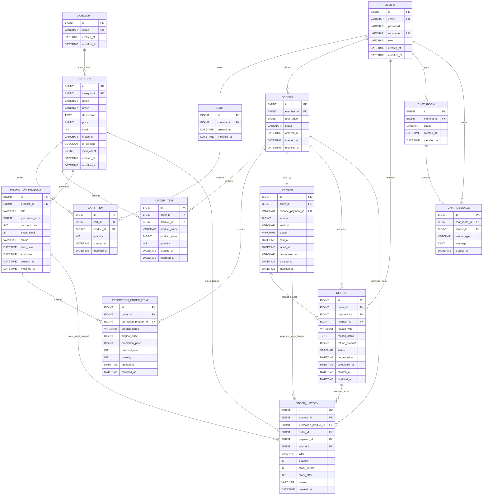
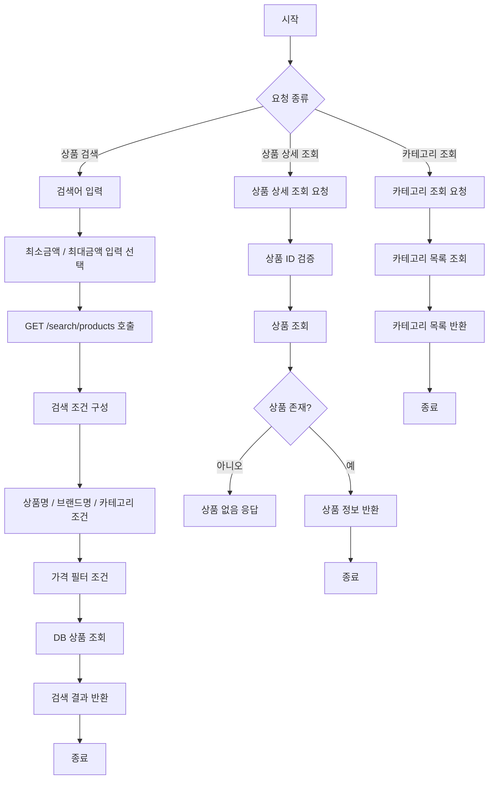

# Database Schema (ER Diagram)

Below is the database schema for the application, representing the entities and their relationships.

# User Flow (Flowchart)

Below is the flowchart representing the core user flows of the application (Product Search, Product Detail, Category list).

