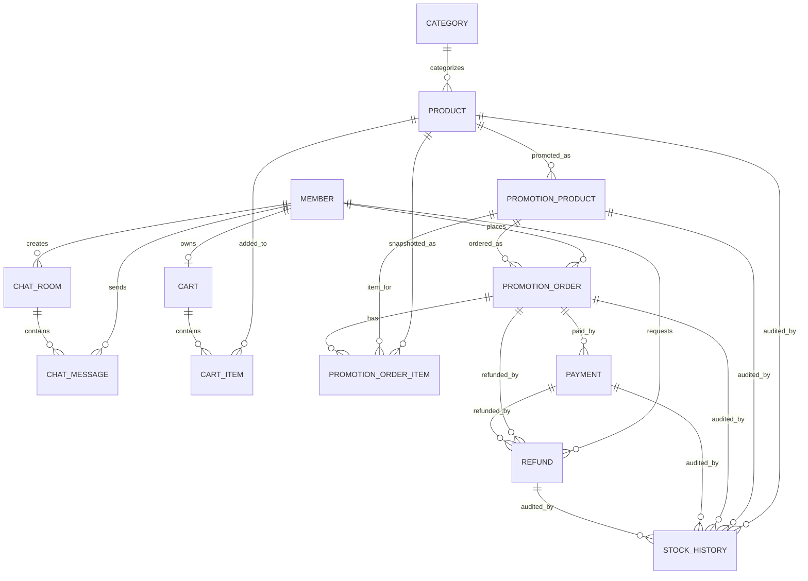

# 오늘의 특가 마켓 ERD

이 문서는 `team8-sale-commerce` 프로젝트의 공통 도메인 모델을 정리한 문서입니다. PR 리뷰, 기능 설계, API 흐름 점검 시 엔티티 관계와 상태 전이를 확인하는 기준으로 사용합니다.

## 엔티티 요약

| 엔티티 | 책임 | 주요 필드 |
| --- | --- | --- |
| `MEMBER` | 사용자/관리자 계정 | `id`, `email`, `password`, `nickname`, `role`, timestamps |
| `CATEGORY` | 상품 카테고리 | `id`, `name`, timestamps |
| `PRODUCT` | 일반 상품 정보 | `category_id`, `name`, `brand`, `description`, `price`, `stock`, `image_url`, `is_deleted`, `view_count`, timestamps |
| `PROMOTION_PRODUCT` | 특가 이벤트 상품 | `product_id`, `title`, `promotion_price`, `discount_rate`, `total_event_stock`, `remaining_event_stock`, `status`, `start_time`, `end_time` |
| `PROMOTION_ORDER` | 특가 구매 주문 | `member_id`, `promotion_product_id`, `total_amount`, `status`, `ordered_at`, `paid_at`, `payment_failed_at`, `refund_requested_at`, `refunded_at` |
| `PROMOTION_ORDER_ITEM` | 특가 주문 상품 스냅샷 | `promotion_order_id`, `promotion_product_id`, `product_id`, `product_name`, `quantity`, `unit_price`, `total_price` |
| `PAYMENT` | PortOne 결제 기록 | `order_id`, `portone_payment_id`, `amount`, `method`, `status`, paid/failed fields |
| `REFUND` | 환불 요청 및 PG 환불 결과 | `order_id`, `payment_id`, `member_id`, `refund_reason_type`, `refund_amount`, `status`, requested/completed/failed fields, PortOne cancellation fields |
| `STOCK_HISTORY` | 재고 변경 이력 | `product_id`, `promotion_product_id`, `order_id`, `payment_id`, `refund_id`, `type`, `quantity`, `stock_before`, `stock_after`, `reason`, `created_at` |
| `CART` | 회원 장바구니 | `member_id`, timestamps |
| `CART_ITEM` | 장바구니 상품 | `cart_id`, `product_id`, `quantity`, `deleted_at`, timestamps |
| `CHAT_ROOM` | 고객 문의 채팅방 | `created_by`, `name`, `status`, timestamps |
| `CHAT_MESSAGE` | 채팅 메시지 | `chat_room_id`, `sender_id`, `content`, timestamps |

## Mermaid ERD

## 상태값과 전이 규칙

| 도메인 | 상태값 | 전이/검증 규칙 |
| --- | --- | --- |
| `MEMBER.role` | `USER`, `ADMIN` | 관리자 전용 API는 role을 명시적으로 확인해야 합니다. |
| `PROMOTION_PRODUCT.status` | `READY`, `OPEN`, `SOLD_OUT`, `CLOSED` | 이벤트 시간이 유효하고 `OPEN`인 경우에만 구매할 수 있습니다. 품절 시 구매를 중단하고 품절 안내를 반환해야 합니다. |
| `PROMOTION_ORDER.status` | `WAITING`, `PAID`, `PAYMENT_FAILED`, `REFUND_REQUEST`, `REFUNDED` | 결제 승인은 `WAITING`, 환불 요청은 `PAID`, 환불 완료는 `REFUND_REQUEST`에서만 가능합니다. |
| `PAYMENT.status` | `PAID`, `FAILED` | 결제 성공은 `PAID`, 실패/검증 실패는 `FAILED`로 저장합니다. PortOne 결제 ID 중복을 방지해야 합니다. |
| `REFUND.status` | `REFUND_REQUEST`, `PORTONE_REFUND_SUCCEEDED`, `REFUNDED`, `REFUND_FAILED` | PortOne 환불 성공 정보를 먼저 저장한 뒤 내부 환불 완료 처리를 진행합니다. |
| `STOCK_HISTORY.type` | `DECREASE`, `RESTORE` | `DECREASE`는 수량 차감, `RESTORE`는 수량 복구 계산과 일치해야 합니다. |
| `STOCK_HISTORY.reason` | `PROMOTION_PURCHASE`, `PAYMENT_FAILED`, `REFUND_COMPLETED` | 실제 재고 변경 사유와 일치해야 합니다. |
| `CHAT_ROOM.status` | `WAITING`, `IN_PROGRESS`, `CLOSED` | 새 채팅방은 `WAITING`으로 시작합니다. `CLOSED` 방에는 메시지를 보낼 수 없습니다. |

## 관계 및 무결성 규칙

- `MEMBER.email`, `MEMBER.nickname`은 중복되면 안 됩니다.
- 회원은 하나의 장바구니를 가집니다.
- 장바구니 상품 수정/삭제는 장바구니 소유 회원만 가능해야 합니다.
- 사용자에게 노출되는 상품 조회는 삭제 상품을 제외해야 합니다.
- 특가 구매는 `PROMOTION_ORDER`를 `WAITING` 상태로 만들고, 주문 상품의 가격/상품명 스냅샷을 남겨야 합니다.
- 결제 승인은 주문 소유자, 주문 상태, PortOne 결제 금액, PortOne 결제 ID 중복 여부를 검증해야 합니다.
- 결제 실패 시 이벤트 재고를 정확히 한 번 복구하고 재고 이력을 저장해야 합니다.
- 환불 요청은 주문 소유자, `PAID` 주문 상태, 결제 완료 Payment 존재 여부, 중복 환불 상태를 검증해야 합니다.
- PortOne 환불 성공 정보는 내부 환불 완료 처리보다 먼저 저장해야 운영 복구가 가능합니다.
- 환불 완료 시 이벤트 재고를 정확히 한 번 복구하고 재고 이력을 저장해야 합니다.
- 채팅방/메시지 조회는 방 소유자 또는 관리자 권한을 확인해야 합니다.

## 담당 영역

| 영역 | 주요 패키지 |
| --- | --- |
| 인증/회원/보안/채팅 | `domain.auth`, `domain.member`, `global.security`, `domain.chat` |
| 상품/카테고리/검색 | `domain.product`, `domain.category` |
| 장바구니/주문 | `domain.cart`, `domain.order`, `domain.promotion` 주문 관련 API |
| 특가/결제/환불/재고 | `domain.promotion`, `domain.payment`, `domain.refund`, `domain.stock` |

PR 리뷰 시 담당 영역을 넘어가는 변경은 별도로 공유하고 확인합니다.
