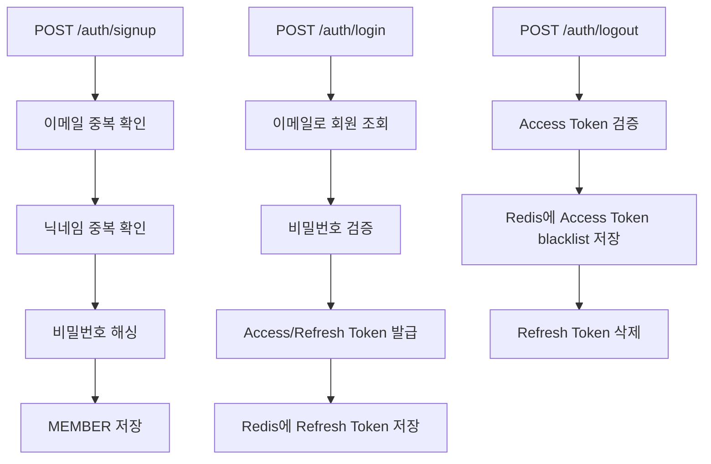
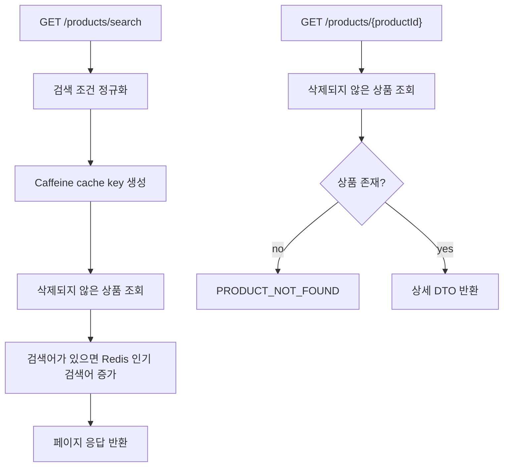
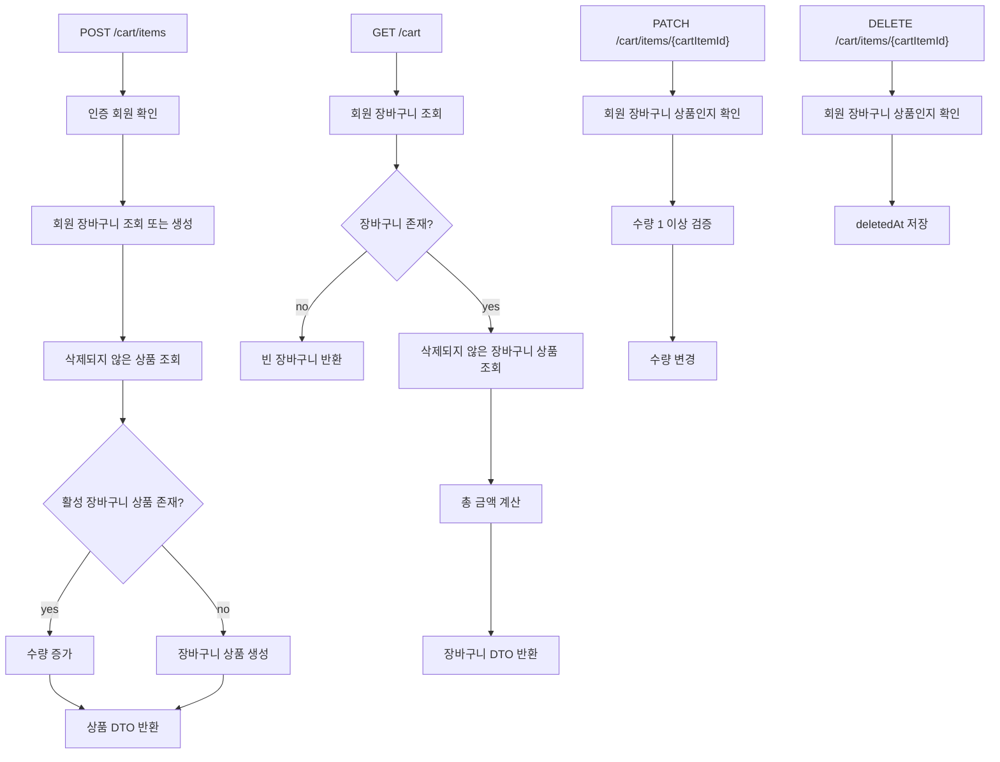
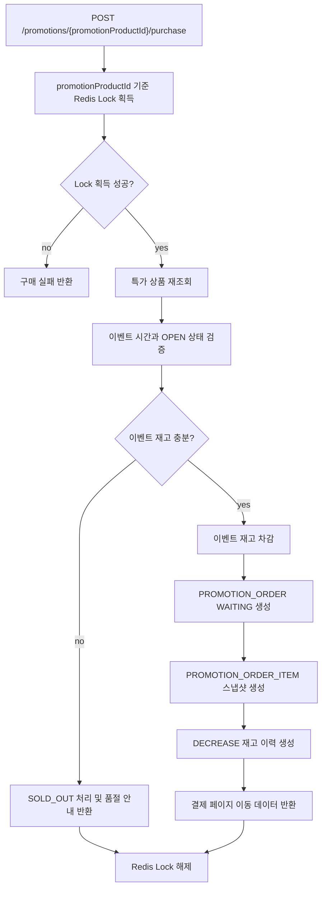
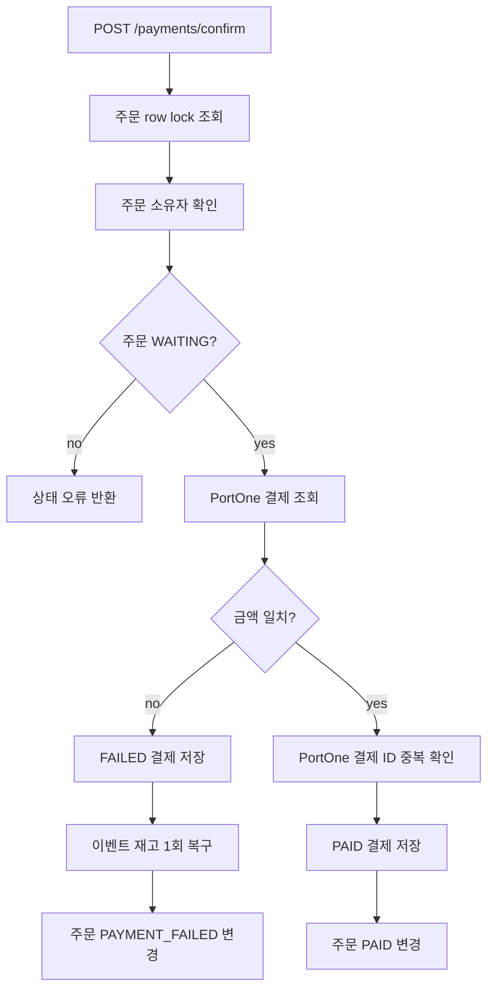
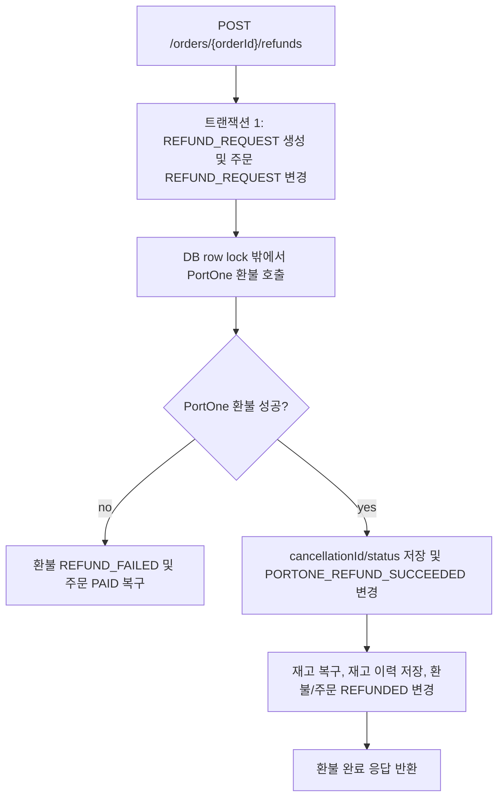
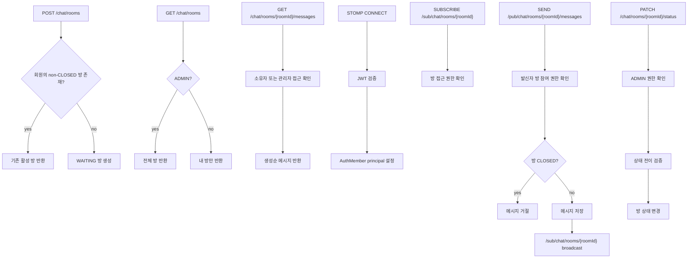

# 오늘의 특가 마켓 플로우차트

이 문서는 주요 API와 도메인 흐름을 Mermaid 플로우차트로 정리한 문서입니다. 기능 구현, PR 리뷰, 테스트 케이스 작성 시 참고합니다.

## 인증 흐름

검토 포인트:
- 비밀번호 원문 저장 금지
- 로그아웃 시 access token blacklist와 refresh token 삭제 모두 처리
- Redis가 필요한 테스트/프로필 분리 여부 확인

## 상품 검색 및 상세 조회 흐름

검토 포인트:
- 삭제 상품 노출 금지
- 가격 범위와 빈 검색어 처리 확인
- 검색 조건이 cache key에 모두 포함되는지 확인

## 장바구니 흐름

검토 포인트:
- 컨트롤러에서 인증 객체 null 처리
- soft delete와 unique 제약 조합에서 삭제 상품 재담기 가능 여부 확인
- 수량은 1 이상이어야 함
- 수정/삭제 시 타 회원 장바구니 상품 접근 차단

## 특가 구매 흐름

검토 포인트:
- 모든 분기에서 Redis Lock 해제
- Lock 획득 후 mutable 데이터 재조회
- 재고 차감 전후 수량과 이력 정확성
- 품절 상태와 UI 안내 일관성

## 결제 승인 흐름

검토 포인트:
- 주문 소유자와 주문 상태를 먼저 확인
- 결제 금액 위변조 방지
- PortOne 결제 ID 중복 방지
- 실패 처리 시 재고 복구가 정확히 한 번만 발생

## 환불 흐름

검토 포인트:
- DB row lock을 잡은 상태로 PortOne을 호출하지 않기
- PortOne 성공 정보는 내부 완료 처리보다 먼저 저장
- PortOne 성공 후 내부 완료 실패 시 운영 복구 가능한 데이터가 남아야 함
- 주문 소유자와 `PAID` 상태 검증
- 중복 환불 요청 차단
- 재고 복구가 정확히 한 번만 발생

## 채팅 흐름

검토 포인트:
- WebSocket subscribe/send 경로 일치
- 잘못된 `/sub/chat/**` destination 차단
- 메시지 저장 후 broadcast
- `CLOSED` 방 메시지 전송 차단
- 관리자 메시지 조회는 role 기반으로 처리
